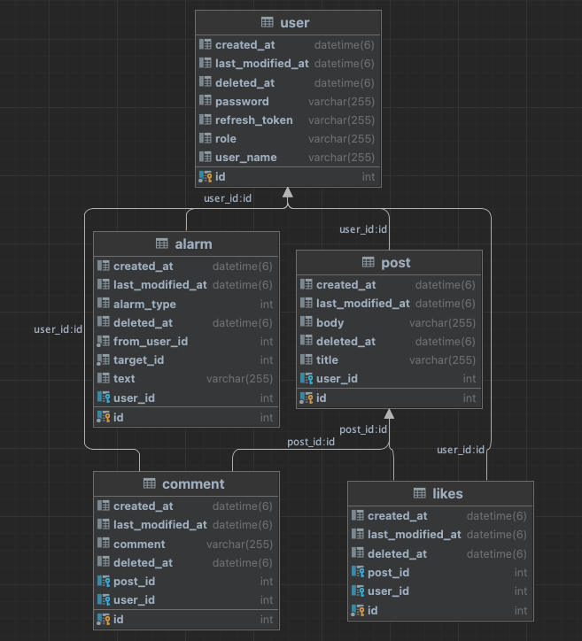
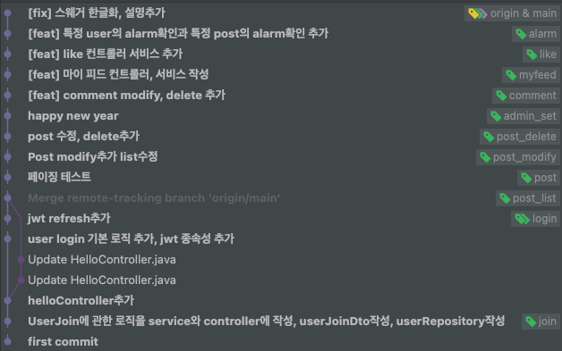

# 멋사스네스

## ABOUT
멋쟁이 사자처럼 + SNS의 합성어로 사이트의 로그인해서 다른 전세계의 유저들과 소통이 가능한 SNS입니다

## 사용 스택, 환경
- Java, Spring
- MySql
- Docker
- AWS

## ERD


## GIT branch


## 링크
 - REST
   - local swagger : http://localhost:8080/swagger-ui/index.html
   - aws swagger : http://ec2-15-164-216-178.ap-northeast-2.compute.amazonaws.com:8080/swagger-ui/index.html

## 주요 기능
- post, join 테스트 주도 개발을 진행하였습니다
- 예외와 에러가 발생할 것을 대비해 예외처리를 해주었습니다
- 스프링 시큐리티와 jwt를 이용해 보안을 강화하였습니다
- RESTful한 코드를 작성했습니다
- JPA를 이용해 쿼리를 작성했습니다
- gitlab과 aws-ec2의 ubuntu, docker를 이용해 gitlab의 메인 브랜치에 push를 할 경우 자동으로 ci/cd를 하는 로직을 작성했습니다

## 체크리스트
- [x] 로그인, 회원가입 구현
- [x] 글 작성, 수정, 삭제, 상세, 목록 구현
- [x] JWT를 이용해 권한이 있는 유저만 글 작성, 수정, 삭제가능
- [x] 각 포스트마다 댓글추가, 수정, 삭제구현
- [x] 각 포스트마다 좋아요, 좋아요 취소 구현
- [x] 자신의 포스트에 다른 유저가 댓글 or 좋아요를 할 시 알림기능 구현
- [x] 자신의 글들만 모아서 볼 수 있는 마이 피드 구현
- [x] swagger를 이용해 api 자동화
- [x] 테스트코드 작성
- [x] ADMIN은 모든 권한허용
- [x] gitlab에 push할시 자동으로 빌드와 docker push가 되고 aws-ec2에서 crontab을 이용해 실시간 배포 구현
- [x] RESTful한 코드 작성
- [x] 예외처리 구현
- [x] 파일, 클래스, 변수, 함수명을 각각 일관성있게 작성
- [x] 주석처리

## 기능 개발시 고려사항
- RESTful한 프로젝트가 되도록 고려했습니다
- 테스트 작성을위해 DB를 거치지 않고 가짜 객체를 만들어 테스트하는 방법을 spring공식문서와 spring-boot공식문서를보고 확인했습니다
- 클라이언트가 데이터를 요청하고 서버가 데이터를 응답할때 에러가 발생하지 않도록 꼼꼼한 예외처리를 고려했습니다
- 배포하는데 들어가는 시간을 줄이기 위해 자동으로 gitlab에서 빌드를 하고 개인 docker-repository로 push하고 aws-ecs의 ubuntu에서 crontab을 이용해 수시로 docker-repository가 업데이트되었는지 확인해 지속적인 제공을 해주었습니다

## 특이사항
### 아쉬웠던점
- 코드를 구현하는데 일관성있게 구현하지 못했다
- 테스트코드 실패 케이스 작성에 계속 실패했다
- git flow 전략을 잘 지키지 않았다
- 한번에 많은 양을 커밋할때가 많이 있었다

## EndPoint

- 회원가입
```
POST /api/v1/users/join

{
    "userName":"유저이름",
    "password":"비밀번호" 
}
```
- 로그인
```
POST /api/v1/users/login

{
    "userName":"유저이름",
    "password":"비밀번호" 
}
```
- 글 작성
```
POST /api/v1/posts

{
    "title":"제목",
    "body":"내용" 
}
```
- 글 목록
```
GET /api/v1/posts
```
- 글 상세정보
```
GET /api/v1/posts/{postId}
```
- 글 수정
```
PUT /api/v1/posts/{postId}

{
    "title":"제목",
    "body":"내용" 
}
```
- 글 삭제
```
DELETE /api/v1/posts/{postId}
```
- 유저 권한 변경
```
POST /api/v1/users/{userId}/role/change

{
    "userRole":"USER"|"ADMIN"
}
```
- 댓글 목록
```
GET /api/v1/posts/{postId}/comments
```
- 댓글 작성
```
POST /api/v1/posts/{postId}/comments
{
   "comment":"댓글 내용"
}
```
- 댓글 수정
```
PUT /api/v1/posts/{postId}/comments/{commentId}
{
   "comment":"댓글 수정 내용"
}
```
- 댓글 삭제
```
DELETE /api/v1/posts/{postId}/comments/{commentId}
```
- 마이 피드
```
GET /api/v1/posts/my
```
- 특정 포스트 좋아요 개수
```
GET /api/v1/posts/{postId}/likes
```
- 좋아요 | 좋아요 취소
```
POST /api/v1/posts/{postId}/likes
```
- 특정 포스트 알림 목록
```
GET /{postId}/alarms
```
- 유저 알림 목록
```
GET /alarms
```